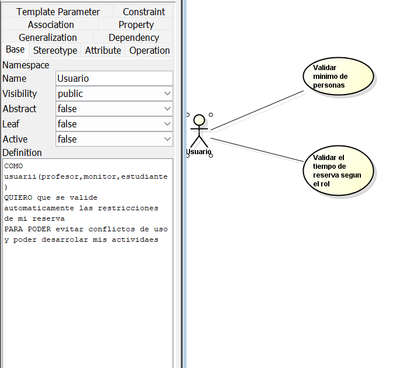
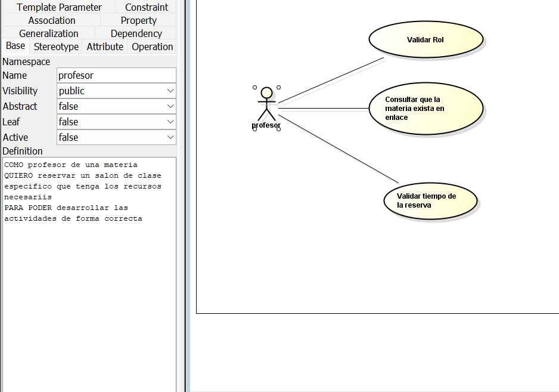

# DOSW_ParcialT1_KevynForero

1. Diagrama de contexto

2. Identifique 2 patrones de diseño que puedan aplicarse al caso de estudio,
   especificando por cada uno:

 - Patron Strategy el cual es de comportamiento ya que el sistema maneja multiples tipos de recursos y cada recurso maneja ciertas reglas de validacion de reserva distintas
 Por ejemplo: Los salones validan materias mientras que las salas de estudio validan un minimo de estudiantes
Este patron nos permite encapsular cada logica de validacion en distintas clases lo cual facilita la seleccion del algoritmo de reserva que se use, mejorando los tiempos de ejecucion

 - Patron Adapter el cual es estructural ya que Silabinfo debe integrarse con sistemas externos como lo es Enlace y Recursos humanos los cuales entregan informacion en formatos de cadena especificos como lo es el id o correo, ya que este solo acepta datos especificos como el correo institucional, se necesita de un adaptador que transforme las interfaces y formatos de los sistemas externos para que sean compatibles con la logica interna

git merge nombre de la rama

3. Identifique 5 requerimientos del sistema y clasifíquelos en funcionales (3) y
   no funcionales (2). Garantiza que al menos un requerimiento funcional
   seleccionado utilice un patrón identificado. (Añadirlo al README.md)
### Requerimientos Funcionales
Rf1 proceso de reservas: el sistema debe ejcutar el algoritmo de reserva indicado, con pasos ya predefinidos como por ejemplo autenticaciom, el cual permita que el sistema solo deje realizar las reservas a los usuarios definidos, por ejemplo que solo un profesor o monitor puedan realizar la reserva de un salon, o que el profesor sea el unico que puede resrevar una oficina

Rf2 validacion de tiempo: aqui el sistema debe veriricar las duraciones de las reservas y ya con eso despues que verifique no exceda el tiempo limite dependiendo de lo reservado, tambien debe verificar que el horario este libre

Rf3 integrar con servicios de datos externos(Adapter): aqui el sistema debe procesar o informacion que provenga de recurss humanos o de enlace para validar lo que se solicite

### Requerimientos No Funcionales
RNf1 interfaz adaptable: aqui el sistema debe garantizar que se visialuce de forma correcta en cualquier dispositivo ya sea un pc o un celular

RNf2 diseño institucional: el diseño del sistema debe emplear los colores de ingenieria de sistemas

4. Del listado anterior, seleccione los 2 requerimientos funcionales más
   importantes del sistema y desarrolle un diagrama de casos de uso con su
   respectiva historia de usuario. Garantiza que al menos un requerimiento
   funcional seleccionado utilice un patrón identificado. (Añadirlo al
   README.md)

5. Especifique los 2 requerimientos funcionales seleccionados en el punto
   anterior (Ver plantilla). (Añadir los documentos al repositorio, en la carpeta
   de requerimientos).

ID: Rf1
Nombre del requerimiento: Proceso de reserva
Descripcion: el sistema debe permitir al usuario realizar el prceos de reserva siguien ciertos pasos como por el ejemplo su ROL
ACTOR: Profesor, Estudiante, Monitor
Flujo principal: 1. el actor selecciona su usuario, 2. el sistema ejecuta una plantilla de resrva segun disponibilad, 3.el sistema veririca datos,4. se confirma la reserca
Diagraama de caso de uso; La foto esta en el punto 4
Posconficiones: Se espera que se genere la reserva 

ID: Rf2
Nombre del requerimiento: Validacion del tiempo
Descripcion: el sistema debe validar el tiempo y restricciones de la reserva segun lo que se elija
Actor: Usuario(Profesor, Monitor, Estudiante)
Flujo principal: 1. el actor selecciona su usuario, 2. escoge que va a reservar, 3. se valida las restricciones, 4. se realiza la reserva.
Diagrama de caso de uso: esta en la foto el punto 4
Poscondiciones se espera que se cumpla todo y genere la reserva

